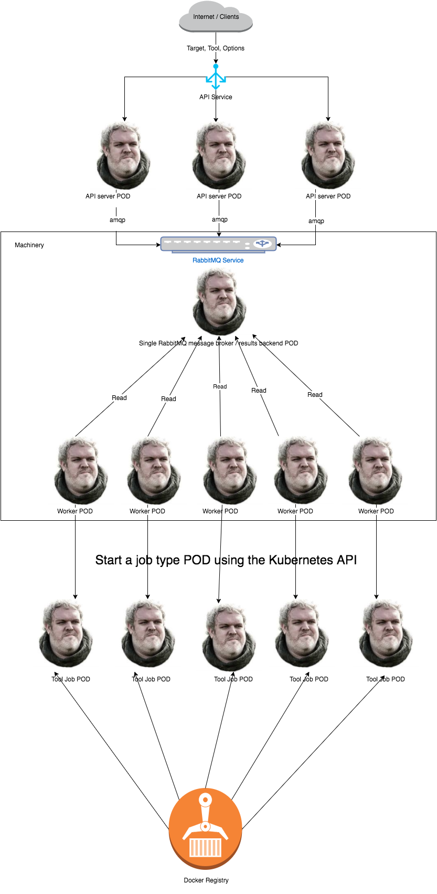
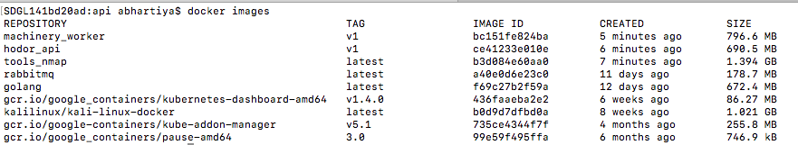
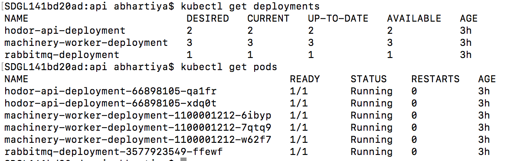
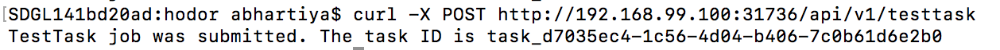
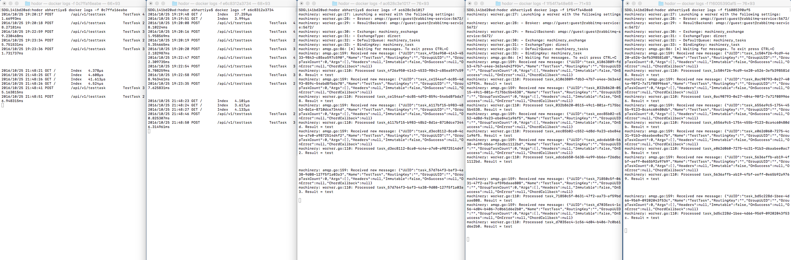

# hodor
Scaleable DevSecOps Testing Framework built on Kubernetes

## Getting Started
### Local Deployment using Minikube
* Install docker-machine (https://docs.docker.com/machine/install-machine/) and kubectl (http://kubernetes.io/docs/user-guide/prereqs/).

* Git clone this repo.

* Install Minikube (http://kubernetes.io/docs/getting-started-guides/minikube/).

* Type `minikube start` to start a single node Kubernetes cluster on your local machine.

* Type `minikube dashboard` to start the Kubernetes dashboard in your browser.

* Back in the terminal, type `eval $(minikube docker-env)` to setup your docker config to point to minikube's docker environment.

* Now, you can do a `docker ps -a` or `docker images` to see all the Docker containers/images of your Minikube Kubernetes cluster for troubleshooting, etc. 

* You can also run commands like `kubectl get nodes` or `kubectl get pods` to get started with running kubectl commands on your local Kubernetes cluster. If you want to switch `kubectl` to query a different Kubernetes cluster, you can do that by listing all the contexts by `kubectl config view` and then typing `kubectl config use-context <context-name>`. So, when you are done developing and testing locally and want to deploy the Kubernetes cluster remotely on Google Container Engine or the likes, you can do that by simply switching the context.

* Next, navigate to `hodor/tools` and create a directory for your tool. Right now, I have the nmap directory as a PoC.

* After creating the tool directory, create a `Dockerfile` for that tool inside that directory. Notice how I have the Dockerfile for nmap defined inside the `nmap` directory.

* Next, build that Dockerfile by typing `docker build -t <tool-image-name> .` after navigating to the directory where you have the `Dockerfile`. This will build a Docker image for your tool and upload it to the local Docker registry which can then be pulled by Kubernetes orchestration when we want to run the tool. For now, since this is the setup for local development, the Docker images will be built in the local Docker registry. When you are ready to use Google Container Engine to deploy the Docker images of your tools, you would have to connect to your Google Cloud account and then build the images in the Google Container Registry accordingly. 

* So, do this for the nmap tool - `docker build -t tools_nmap .` after navigating to the nmap directory which has its Dockerfile.

* Run `docker images` to verify you can see the docker image of your tool. Please note you need to build Docker images of your tools to be able to run it in this framework. And, every time you do some changes in your tool, you would have to rebuild its Docker image.

* We also need a few other Docker images built for the API server, the RabbitMQ broker and the Machinery Worker.

* So, navigate to the `hodor` directory and build the Docker image for the API server by typing `docker build -t hodor_api:v1 .`

* Navigate to the `hodor/api` directory and build the Docker image for the Machinery worker by typing `docker build -t machinery_worker:v1 .`

* We will be using a public RabbitMQ image so just type `docker pull rabbitmq` to make sure you have that image as well.

* At this point, you should be set to start your deployments in the Kubernetes cluster. Just make sure, your local docker registry looks like below when you do a `docker images`:

* There are 5 yaml files right now:
    * `hodor/api/hodorapi-deployment.yaml` (deploys 2 replicas for the API server running on port 3636)
    * `hodor/api/hodorapi-service.yaml` (exposes and load balances the API server)
    * `hodor/api/worker/worker-deployment.yaml` (deploys 3 replicas for the machinery workers that consumes the message from the rabbitmq broker)
    * `hodor/rabbitmq/rabbitmq-deployment.yaml` (deploys 1 replica for the rabbitmq broker running on port 5672)
    * `hodor/rabbitmq/rabbitmq-service.yaml` (exposes the rabbitmq broker to the API servers as rabbitmq-service to talk to and submit jobs/tasks)

 * For each of these above yaml files, run `kubectl create -f <name-of-yaml>`. You can also run it recursively by issuing the `kubectl create -f . --recursive` from the `/hodor` directory.

 * Once you do this, your local Kubernetes cluster should be up and running. Verify it by typing `kubectl get deployments` and `kubectl get pods`. You should see 3 machinery workers, 2 api servers, 1 rabbitmq broker. See screenshot below:
 

 
 * You can also navigate to the minikube dashboard to see all the PODS in action. The dashboard makes it much simpler to display what is going on under the hood.

 * Next, find out the IP of your Minikube docker-env by typing `minikube docker-env` and capturing the IP under `DOCKER_HOST`.

 * Next, find the port the API service is exposed to by navigating to `Services` in the minikube dashboard. It should be the one under port 80. Minikube doesn't loadbalance properly since its running locally and not remotely. So, the port `80` that we really want to expose wouldn't work. The other port works though. This should work once you deploy your cluster remotely.

 * Finally, send a curl request to the API service `curl -X POST http://IP:PORT/api/v1/testtask`. The `testtask` is defined in the `hodor/api/tasks/tasks.go` file. You should see something like below:

* This basically shows that the API request to sent to submit the `testtask` was dropped in the RabbitMQ queue. It then returned the `task UUID` which can then be queried to find out about the state of this job.

* On the backend, this job was successfully picked up by one of the machinery workers and processed successfully. 

* See the screenshow below where the first 2 screens display the logs from the API PODs. You can see logs in both the PODs showing that the traffic was loadbalanced as expected. The next 3 screens are the 3 machinery workers that pick up the jobs from the RabbitMQ queue. The traffic in all 3 workers also shows that the workers are all working fine picking up jobs from the queue. We can scale the number of API PODs or the Worker PODs up/down depending upon the load which is the beauty of Kubernetes. 

* Results from the tool runs are saved in `/api/results` directory in the `minikube` node. So, you would have to ssh into minikube using `minikube ssh` and then navigate to `cd /api/results` directory to view the outputs of the tools. This is because we store the results from the tools into a `results` directory which is then mapped to the `result` volume on the Job pod. This volume is further mapped onto the host's `$pwd/results` path from where the worker pod ran. Since we are running a 1 node cluster locally using minikube, our host is minikube and all the output is stored in the `/api/results` directory inside minikube.  

* Once the tools are run and the results are saved, the Job pods and containers are deleted making the orchestration clean without leaving any dangling containers behind. 

### Local Development using out-of-cluster config of Kubernetes 
Building Docker images every time some code is changed and applying the newly built Docker images to the Kubernetes cluster can be quite frustrating when you are actually developing something in the framework.
To make this easier, development is recommended using `out-of-cluster` configuration of Kubernetes. Once you are confident everything works the way its supposed to be, you can deploy it `in-cluster`.
By this, I mean that there are certain changes you would have to do in order to achieve this setup:

* First off, you need to change the broker value from `rabbitmq-service` to `localhost` in both `handlers.go` and `worker.go` files. This is because you will be starting a local RabbitMQ broker and for the workers to connect to that, you would need to specify how to reach that broker. 
* Next, in the `tasks.go` file, comment out the 2 lines after the function `RunTool` is defined. And, uncomment the 2 lines below that. So, comment out:
> config, err := rest.InClusterConfig()
> check(err)
And, uncomment:
> // config, err := clientcmd.BuildConfigFromFlags("", "/path/to/.kube/config")
> // check(err)
* You are basically switching from `in-cluster` to `out-of-cluster` by doing the above. 
* Next, in a terminal, start the rabbitmq-server by typing in `rabbitmq-server`
* In a different terminal, start the workers by navigating to the `hodor/api/worker` directory and typing `go run worker.go`
* Finally, in another terminal, start the API server by navigating to the `hodor/api` directory and typing `go run *.go`
* You are now ready to send API requests like: `curl -X POST http://localhost:3636/api/v1/testtask` or `curl -H "Content-Type: application/json" -X POST -d '{"Toolname":"tools_nmap","Targets":["IP1", "IP2", "IP3"],"Options":"-Pn -p 1-1000"}' http://localhost:3636/api/v1/runtool`
* The results would be saved under the `hodor/api/worker/results` directory.

### Example UseCase
I have uploaded a Youtube video showing this in action here - https://youtu.be/W7eH7iRtq8U

The usecase is pretty simple:
> We want to send an API request to our load balanced and clustered API server to start NMAP scan against a bunch of targets. 

So, assuming you have completed the steps described above, you already have the cluster up and running:
All you would need to do is send a curl request that looks like below:
`curl -H "Content-Type: application/json" -X POST -d '{"Toolname":"tools_nmap","Targets":["IP1", "IP2", "IP3"],"Options":"-Pn -p 1-1000"}' http://<minikube docker-env IP>:<Internal port of hodor-api-service>/api/v1/runtool`
This would submit 3 jobs (because 3 targets) in the RabbitMQ broker which is then picked up by available Machinery workers.
The workers proceed to start the Docker container from the `tools_nmap` Docker image and run it against the target IP.  
After the scan finishes, the results are saved on the host's $pwd/results directory which would be the `/api/results` directory inside `minikube`.
Once the results are stored, the jobs and pods related to the jobs are deleted from the Kubernetes cluster.

Remember, the number of PODS supporting the API server, RabbitMQ broker and Machinery Worker can all be increased/decreased on the fly without any downtime using Kubernetes. 

### Remote Development/Deployment
The above steps are for getting the framework up and running locally in a single node Kubernetes cluster by using Minikube (free of cost).
However, the real power of Kubernetes is when the cluster is deployed remotely on something like a Google Container Engine but that would obviously cost you some money.
I am not going to cover that part although setting a remote cluster should be pretty straightforward as well.
In order to do that, you would have to ideally switch the `context` of `kubeconfig` and point it to work with the remote Kubernetes cluster rather than the local cluster.
You would also want to make sure that you are connected to your Google Cloud account using the `gcloud` client utility.

### Notes
* The entire architecture will be orchestrated by Kubernetes so the number of pods (API server, RabbitMQ, Worker, Tool) can be increased/decreased depending upon the load by simply calling the Kubernetes API with no downtime. This feature is called `rolling-updates` in Kubernetes. This can also be auto scaled with future versions of Kubernetes.

* All the tools that will be run would be deployed as Docker images either in your local Docker registry or on the Google Container Registry.

* Right now, the RabbitMQ message broker is only 1 POD. This can be improved by deploying a clustered RabbitMQ. 

* Right now, the tools are started as single Docker containers in a POD. But, we can also start multiple Docker containers in a POD. 

* The tool used for the message broker and worker is called machinery - https://github.com/RichardKnop/machinery.

* At some point, we should implement Authentication for the API calls, HTTPS for reaching the API service, etc.

* You can always write more tasks in the `tasks.go` file and define the routes in `routes.go` file. It doesn't have to be that this framework is only being used to run tools against targets. 

* This framework is actively being worked on using different offerings of the Google Cloud such as Google Pub/Sub and Google BigQuery for some Data Analytics on the results of the tools. I will try to open source those parts as well.

* If its a tool like nmap where you have to specify the name of the output file, you would have to modify some code because you would want different filenames for each time nmap is run. Check out the nmap example for this. 